<h2>TensorFlow-FlexUNet-Image-Segmentation-Prostate-Cancer-MRI (2026/07/09)</h2>
<h3>Prostate-Cancer-MRI: AI Generated Pseudo Masks Segmentation Challenge</h3>
Sarah T. Arai 
Software Laboratory antillia.com  
This is the first experiment of Image Segmentation for <b>Prostate-Cancer-MRI</b> based on 
our <a href="./src/TensorFlowFlexUNet.py">TensorFlowFlexUNet</a>
 (<b>TensorFlow Flexible UNet Image Segmentation Model for Multiclass</b>), and a 512x512 pixels PNG
 <a href="https://drive.google.com/file/d/1gnUlH_7i0lV4BSNKPCf4yXPjcU5qMkvF/view?usp=sharing">
Prostate-Cancer-MRI-ImageMask-Dataset.zip</a> with <b>AI generated pseudo masks</b> 
(<a href="https://creativecommons.org/licenses/by-sa/3.0/">CC BY-SA 3.0</a>), which was derived by us from   
<a href="https://www.kaggle.com/datasets/sshikamaru/world-wide-covid-dataset/data">
<b>Prostate Cancer MRI
</b>
</a> by Kaizen.
  

<b>Actual Image Segmentation for Prostate-Cancer-MRI Images of 512x512 pixels</b> 
As shown below, the inferred masks predicted by our segmentation model trained by the dataset appear similar to 
the ground truth masks.
  
<table>
<tr>
<th>Input: image</th>
<th>Mask (ground_truth)</th>
<th>Prediction: inferred_mask</th>
</tr>
<tr>
<td>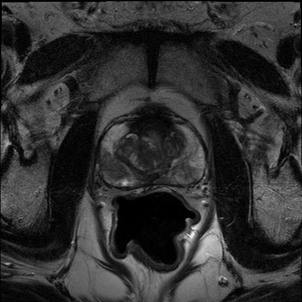</td>
<td></td>
<td>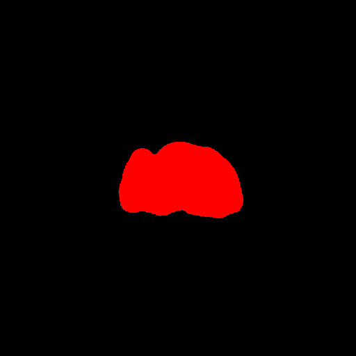</td>
</tr>

<tr>
<td>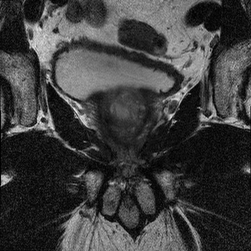</td>
<td>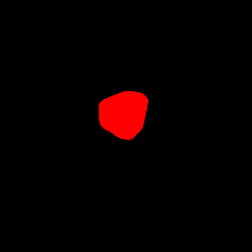</td>
<td></td>
</tr>

<tr>
<td>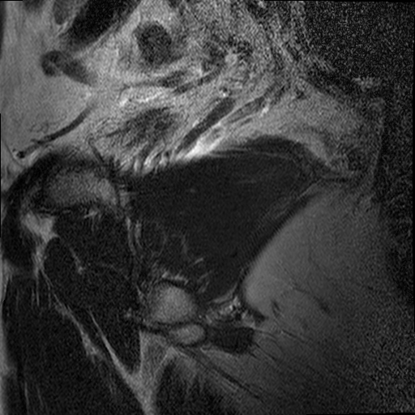</td>
<td>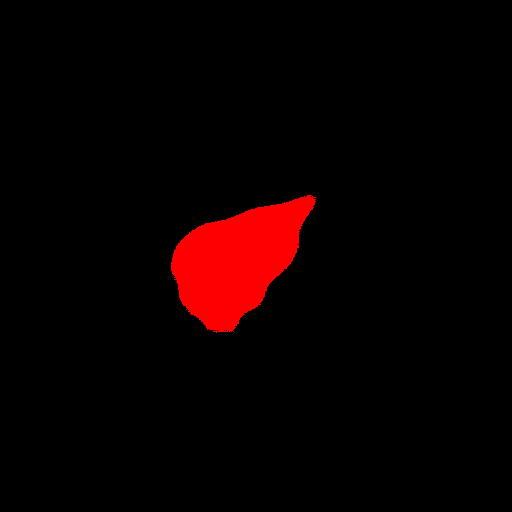</td>
<td></td>
</tr>
</table>

 
<h3>1. Dataset Citation</h3>
The dataset used here was derived from   
Prostate-Cancer-MRI-ImageMask-Dataset.zip</a> with <b>AI generated pseudo masks</b>, which was derived by us from   
<a href="https://www.kaggle.com/datasets/sshikamaru/world-wide-covid-dataset/data">
<b>Prostate Cancer MRI </b></a> 
<b>Prostate Cancer Imaging from the National Cancer Institute</b> by Kaizen.
 
 
The following explanation was taken above zenodo web site.
  
<b>About Dataset</b> 
<b>Dataset Information</b> 
Image Size (GB): 3.2
Modalities: MR (with some PET/CT) 
Number of Images: 22,036 
Number of Participants: 26 
Number of Series: 182 
Number of Studies: 26
  
This collection of prostate Magnetic Resonance Images (MRIs) was obtained with an endorectal and phased array 
surface coil at 3T (Philips Achieva).  
Each patient had biopsy confirmation of cancer and underwent a robotic-assisted radical prostatectomy.  
A mold was generated from each MRI, and the prostatectomy specimen was first placed in the mold, then cut 
in the same plane as the MRI.  
The data was generated at the National Cancer Institute, Bethesda, Maryland, USA between 2008-2010.

  
<b>License</b> 
<a href="https://creativecommons.org/licenses/by-sa/3.0/">CC BY-SA 3.0</a>
 
 
<h3>
2 Prostate-Cancer-MRI ImageMask Dataset
</h3>
<h3>2.1 Prostate-Cancer-MRI ImageMask Dataset</h3>
 If you would like to train this Prostate-Cancer-MRI Segmentation model by yourself,
 please download the dataset from the google drive  
 <a href="https://drive.google.com/file/d/1gnUlH_7i0lV4BSNKPCf4yXPjcU5qMkvF/view?usp=sharing">
Prostate-Cancer-MRI-ImageMask-Dataset.zip</a> (<a href="https://creativecommons.org/licenses/by-sa/3.0/">CC BY-SA 3.0</a>)
, expand the downloaded ImageMaskDataset and put it under <b>./dataset</b> folder to be
 
<pre>
./dataset
└─Prostate-Cancer-MRI
    ├─test
    │   ├─images
    │   └─masks
    ├─train
    │   ├─images
    │   └─masks
    └─valid
        ├─images
        └─masks
</pre>
 
<b>Prostate-Cancer-MRI Statistics</b> 
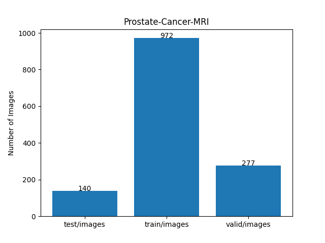 
 
As shown above, the number of images of train and valid datasets is not nough to use for the
 training set of our segmentation model.
 
 
<h3>2.2 Derivation of Prostate-Cancer-MRI ImageMask Dataset</h3>
The folder structure of the original <b>PROSTATE_MRI</b> is the following. It contains MRI DICOM files 
in each sub folders, but no annotation (mask) files,
because it is an image classification dataset,
<pre>
./PROSTATE_MRI
├─MIP-PROSTATE-01-0001
│  └─04-30-2006-NA-MRI Prostate ERC-40831
│      ├─1101.000000-DCE 262 pre-24908
│      ├─1201.000000-DCE 262 3.1-71656
│      ├─401.000000-T2 TSE sag-01264
│      ├─601.000000-T2 TSE cor-63839
│      ├─701.000000-T2 TSE ax hi-65190
│      ├─901.000000-SShDWI FAST-13278
│      └─902.000000-dSShDWI SENSE-21145
...
│ 
└─MIP-PROSTATE-01-0026
    └─07-09-2006-NA-MRI Prostate ERC-15894
        ├─1201.000000-DCE 262 pre-79656
        ├─1301.000000-DCE 262 3.1-94451
        ├─501.000000-T2 TSE sag-41991
        ├─601.000000-T2 TSE ax hi-06592
        ├─701.000000-T2 TSE cor-96411
        ├─901.000000-SShDWI FAST-38702
        └─902.000000-dSShDWI SENSE-38858   
</pre>
<b>Step 1</b> 
We generated a 512x512 PNG master image dataset from the DICOM files in all <b>sagittal(*sag*)</b>, <b>axial(*ax hi*)</b> and 
<b>coronal(*cor*)</b> sub folders. 
<pre>
./Prostate-MRI-PNG-master (1,656 files)
  ├─1001_axi_0.png
...
  ├─1001_axi_25.png
  │
  ├─1001_cor_0.png
... 
  ├─1001_cor_15.png
  │
  ├─1001_sag_0.png
...
  ├─1001_sag_17.png
...
  ├─1026_axi_0.png
...
  ├─1001_axi_25.png
  
  ├─1026_cor_0.png
...
  ├─1026_cor_15.png
  │
  ├─i1026_sag_0.png
...
  └─1026_sag_21.png

</pre>
 
<b>Step 2</b> 
We generated the first <b>pseudo masks </b> corresponding to the master images 
by applying an inference (segmentation) method of
a pretrained FlexUNet model <a href="https://github.com/sarah-antillia/TensorFlow-FlexUNet-Image-Segmentation-PROMISE12-Prostate-Cancer">
<b>TensorFlow-FlexUNet-Image-Segmentation-PROMISE12-Prostate-Cancer</b>
</a> trained by <a href="https://zenodo.org/records/8026660"><b>PROMISE12: Data from the MICCAI Grand Challenge: Prostate MR Image Segmentation 2012</b>
</a> to the master dataset, without human annotation experts.
  
<b>Step 3</b> 
We generated the first Prostate-Cancer-MRI-ImageMask dataset from all pairs of master images and
their corresponding pseudo masks, by excluding all empty black masks and their corresponding images. 
  
<b>Step 4</b> 
We generated the second <b>pseudo masks </b> corresponding to the master images 
by applying a segmentation method of a pretrained FlexUNet model 
</a> trained by the first Prostate-Cancer-MRI-ImageMask dataset to the master dataset.
  
<b>Step 5</b> 
We finally generated our own <b>Prostate-Cancer-MRI-ImageMask-Dataset</b> from all pairs of master images and
the second corresponding pseudo masks, by excluding all empty black masks and their corresponding images. 
  
<h3>2.3 Train Sample Images and Masks</h3>
<b>Train sample images</b> 
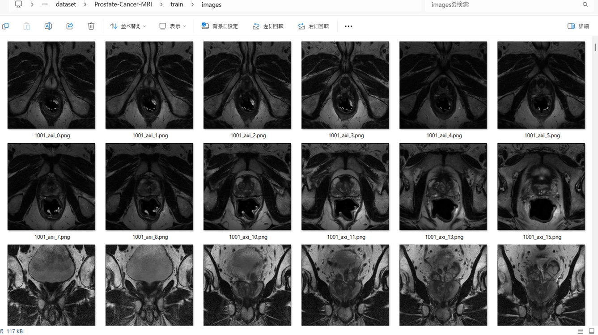
 
<b>Train sample masks</b> 
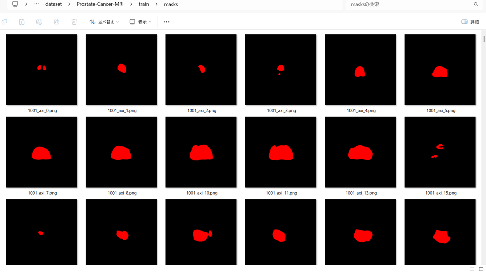
 
<h3>
3 Train TensorFlowFlexUNet Model
</h3>
 We trained Prostate-Cancer-MRI TensorFlowFlexUNet Model by using the 
<a href="./projects/TensorFlowFlexUNet/Prostate-Cancer-MRI/train_eval_infer.config"> <b>train_eval_infer.config</b></a> file.  
Please move to ./projects/TensorFlowFlexUNet/Prostate-Cancer-MRI and run the following bat file. 
<pre>
>1.train.bat
</pre>
, which simply runs the following command. 
<pre>
>python ../../../src/TensorFlowFlexUNetTrainer.py ./train_eval_infer.config
</pre>

<b>Model parameters</b> 
Defined a small <b>base_filters = 16 </b> and large <b>base_kernels = (11,11)</b> for the first Conv Layer of Encoder Block of 
<a href="./src/TensorFlowFlexUNet.py">TensorFlowFlexUNet.py</a> 
and a large <b>num_layers = 8</b> (including a bridge between Encoder and Decoder Blocks).
<pre>
[model]
;You may specify your own UNet class derived from our TensorFlowFlexModel
model         = "TensorFlowFlexUNet"
image_width    = 512
image_height   = 512
image_channels = 3
input_normalize = True
normalization  = False
num_classes    = 2
base_filters   = 16
base_kernels   = (11,11)
num_layers     = 8
dropout_rate   = 0.04
dilation       = (1,1)
</pre>
<b>Learning rate</b> 
Defined a small learning rate.  
<pre>
[model]
learning_rate  = 0.00007
</pre>
<b>Loss and metrics functions</b> 
Specified "categorical_crossentropy" and <a href="./src/dice_coef_multiclass.py">"dice_coef_multiclass"</a>. 
<pre>
[model]
loss           = "categorical_crossentropy"
metrics        = ["dice_coef_multiclass"]
</pre>
<b>Dataset class</b> 
Specifed <a href="./src/ImageCategorizedMaskDataset.py">ImageCategorizedMaskDataset</a> class. 
<pre>
[dataset]
class_name    = "ImageCategorizedMaskDataset"
</pre>
 
<b>Learning rate reducer callback</b> 
Enabled learing_rate_reducer callback, and a small reducer_patience.
<pre> 
[train]
learning_rate_reducer = True
reducer_factor     = 0.4
reducer_patience   = 4
</pre>
<b>Early stopping callback</b> 
Enabled early stopping callback with patience parameter.
<pre>
[train]
patience      = 10
</pre>
<b>RGB Color map</b> 
Specifed rgb color map dict for Prostate-Cancer-MRI 1+1 classes. 
<pre>
[mask]
mask_datatyoe    = "categorized"
mask_file_format = ".png"
;Prostate-Cancer-MRIrgb color map dict for 1+1 classes.
;                      Cancer:red
rgb_map = {(0,0,0):0, (255, 0, 0):1 }
</pre>
<b>Infer section</b> 
<pre>
[infer] 
images_dir    = "./mini_test/images/"
output_dir    = "./mini_test_output/"
</pre>
<b>Epoch change inference callback</b> 
Enabled <a href="./src/EpochChangeInferencer.py">epoch_change_infer callback</a></b>. 
<pre>
[train]
epoch_change_infer       = True
epoch_change_infer_dir   =  "./epoch_change_infer"
num_infer_images         = 6
</pre>
By using this callback, on every epoch_change, the inference procedure can be called
 for 6 images in <b>mini_test/images</b> folder specified in <b>infer</b> section. This will help you confirm how the predicted mask changes 
 at each epoch during your training process.  
<!--
  
As shown below, early in the model training, the predicted masks from our UNet segmentation model showed 
discouraging results.
 However, as training progressed through the epochs, the predictions gradually improved. 
   
 -->
 
<b>Epoch_change_inference output at starting (epoch 1,2,3)</b> 
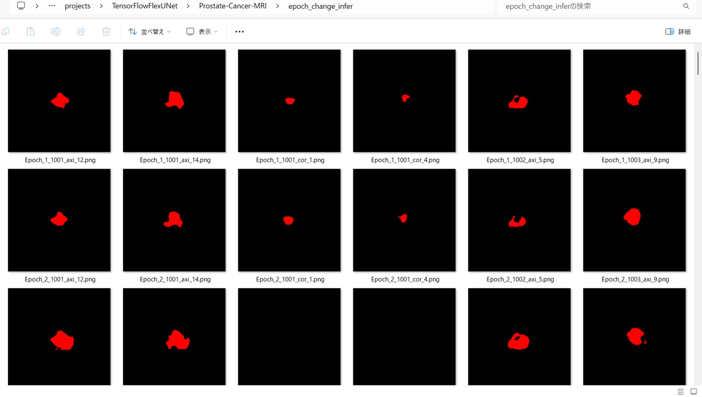 
 
<b>Epoch_change_inference output at middlepoint (epoch 20,21,22)</b> 
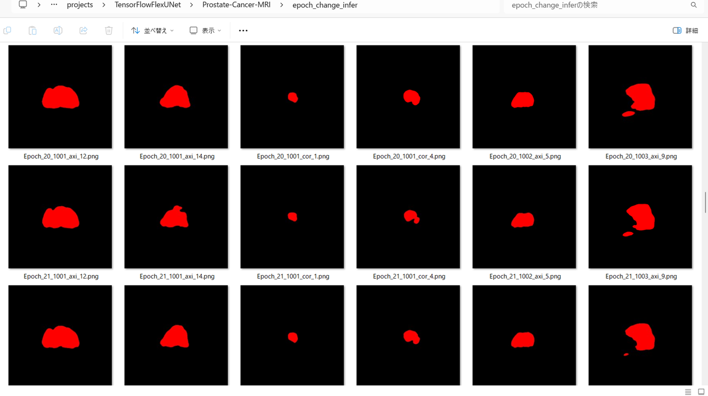 
 

<b>Epoch_change_inference output at ending (epoch 42,43,44)</b> 
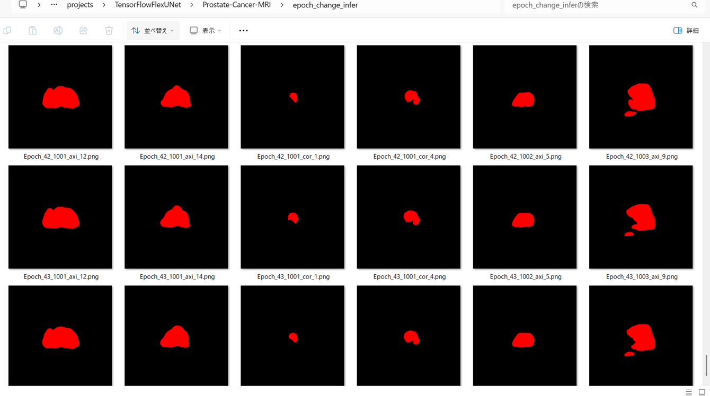 
 

In this experiment, the training process was stopped at epoch 44 by EarlyStoppingCallback.  
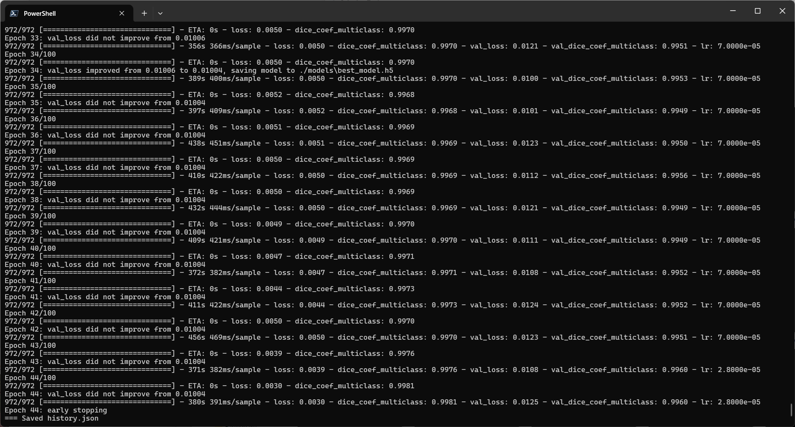 
 

<a href="./projects/TensorFlowFlexUNet/Prostate-Cancer-MRI/eval/train_metrics.csv">train_metrics.csv</a> 
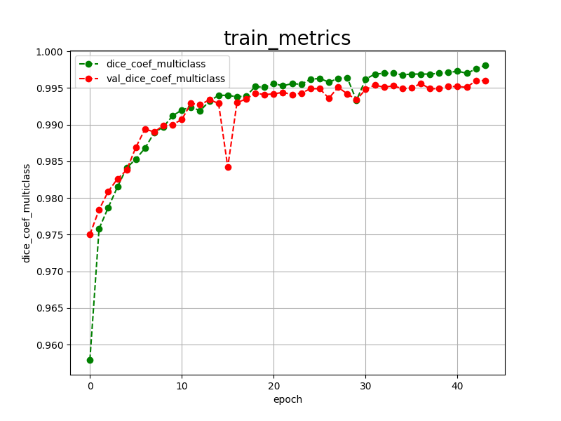 

 
<a href="./projects/TensorFlowFlexUNet/Prostate-Cancer-MRI/eval/train_losses.csv">train_losses.csv</a> 
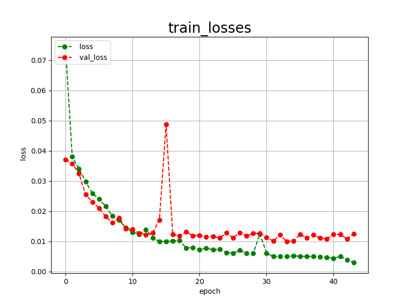 
 
<h3>
4 Evaluation
</h3>
Please move to <b>./projects/TensorFlowFlexUNet/Prostate-Cancer-MRI</b> folder,
and run the following bat file to evaluate TensorFlowUNet model for Prostate-Cancer-MRI. 
<pre>
>./2.evaluate.bat
</pre>
This bat file simply runs the following command.
<pre>
>python ../../../src/TensorFlowFlexUNetEvaluator.py ./train_eval_infer_aug.config
</pre>

Evaluation console output: 
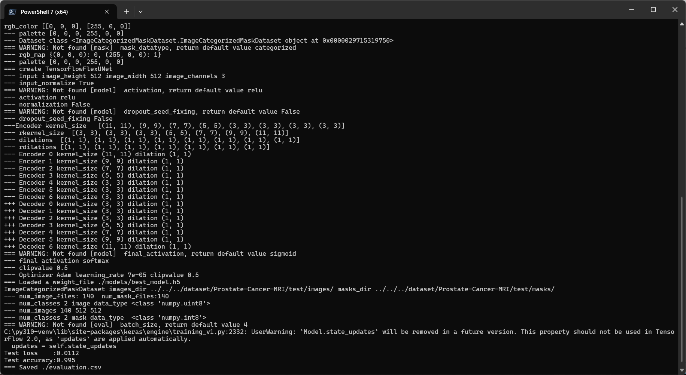
  Image-Segmentation-Prostate-Cancer-MRI

<a href="./projects/TensorFlowFlexUNet/Prostate-Cancer-MRI/evaluation.csv">evaluation.csv</a> 
The loss (categorical_crossentropy) to this <b>Prostate-Cancer-MRI/test</b> was low 
and dice_coef_multiclass high as shown below.
 
<pre>
categorical_crossentropy,0.0112
dice_coef_multiclass,0.995
</pre>
 
<h3>
5 Inference
</h3>
Please move to a <b>./projects/TensorFlowFlexUNet/Prostate-Cancer-MRI</b> folder 
,and run the following bat file to infer segmentation regions for images by the Trained-TensorFlowUNet model for Prostate-Cancer-MRI. 
<pre>
>./3.infer.bat
</pre>
This simply runs the following command.
<pre>
>python ../../../src/TensorFlowFlexUNetInferencer.py ./train_eval_infer_aug.config
</pre>

<b>mini_test_images</b> 
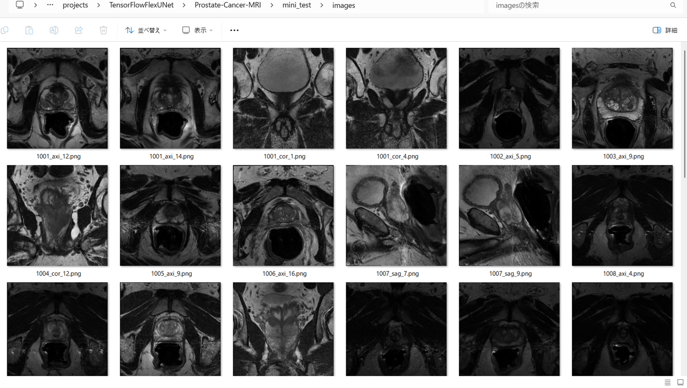 
<b>mini_test_mask(ground_truth)</b> 
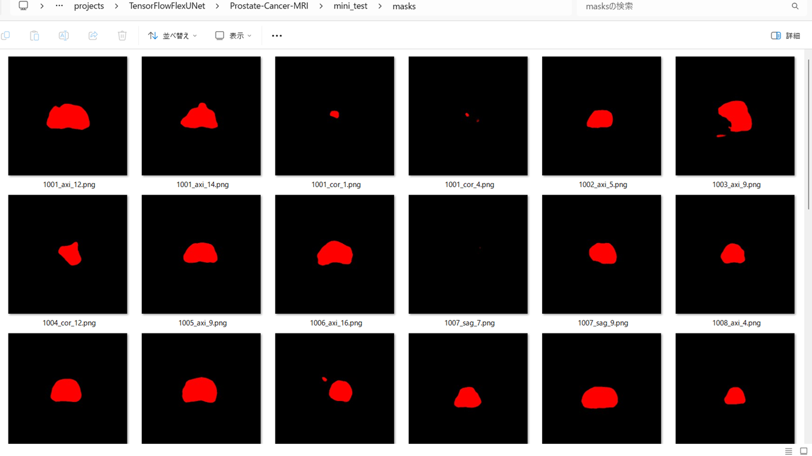 

<b>Inferred test masks</b> 
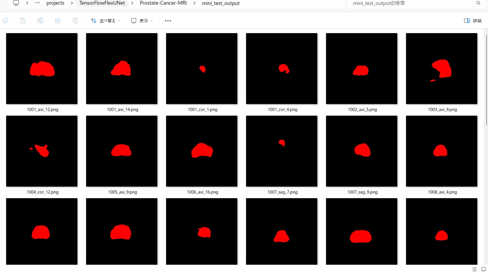 
 

<b>Enlarged images and masks of Prostate-Cancer-MRI Images of 512x512 pixels</b> 
As shown below, the inferred masks predicted by our segmentation model trained by the dataset appear similar 
to the ground truth masks.
  
<table>
<tr>
<th>Image</th>
<th>Mask (ground_truth)</th>
<th>Inferred-mask</th>
</tr>
<tr>
<td>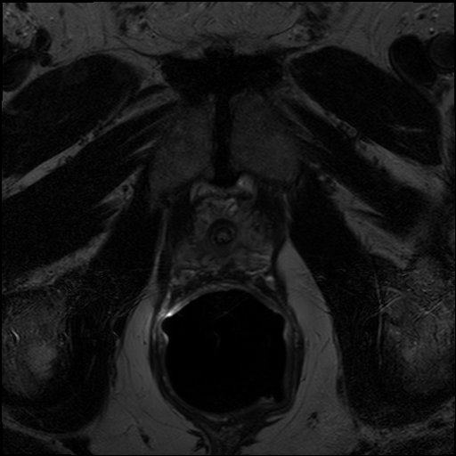</td>
<td></td>
<td>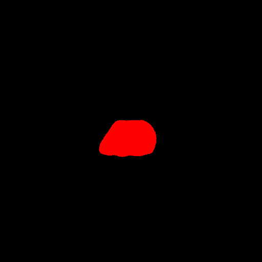</td>

</tr>

<tr>
<td>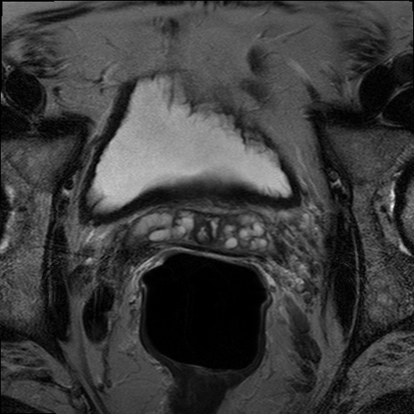</td>
<td>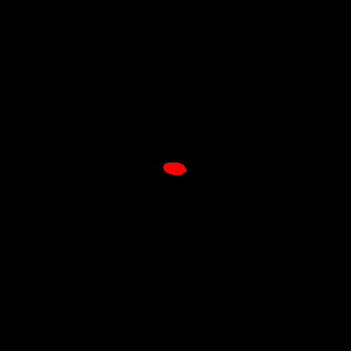</td>
<td>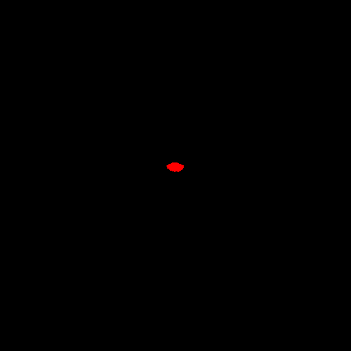</td>
</tr>

<tr>
<td>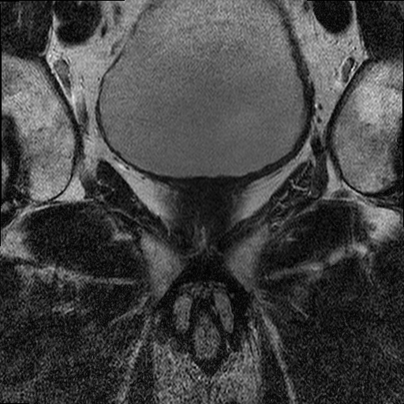</td>
<td>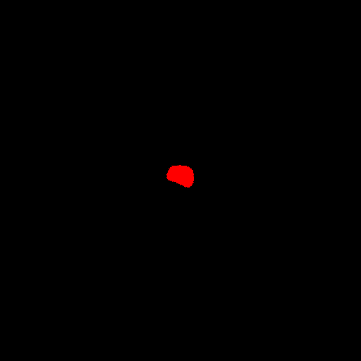</td>
<td>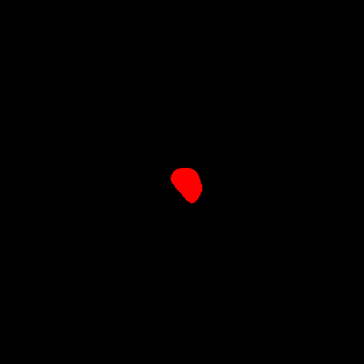</td>
</tr>

<tr>
<td></td>
<td></td>
<td></td>
</tr>

<tr>
<td>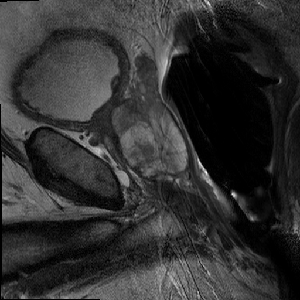</td>
<td></td>
<td>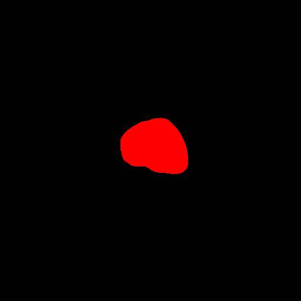</td>
</tr>

<tr>
<td>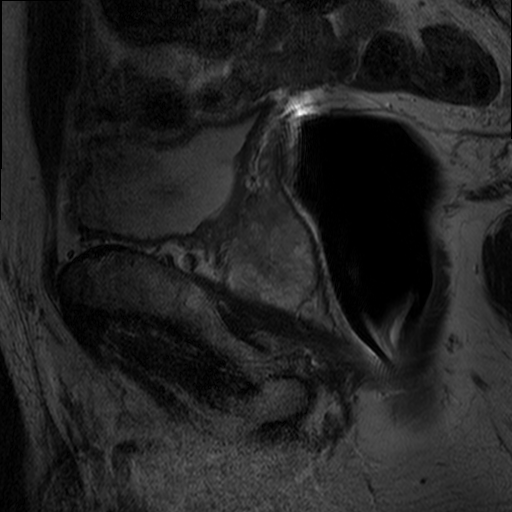</td>
<td>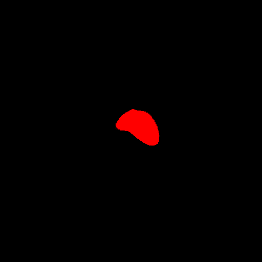</td>
<td>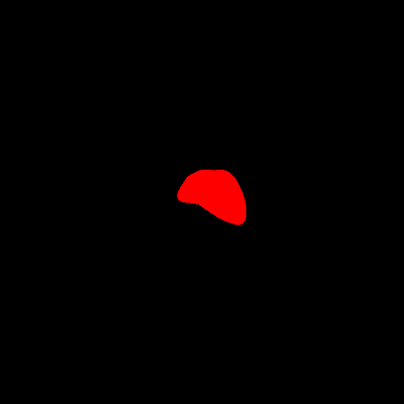</td>
</tr>
</table>

 
<h3>
References
</h3>
<b>1. Evaluation of prostate segmentation algorithms for MRI: The PROMISE12 challenge</b> 
Geert Litjens, Robert Toth, Wendy van de Ven, Caroline Hoeks, Sjoerd Kerkstra, Bram van Ginneken,  
Graham Vincent, Gwenael Guillard, Neil Birbeck, Jindang Zhang, Robin Strand, Filip Malmberg,  
Yangming Ou, Christos Davatzikos, Matthias Kirschner, Florian Jung, Jing Yuan, Wu Qiu, Qinquan Gao, 
 Philip “Eddie” Edwards, Bianca Maan, Ferdinand van der Heijden, Soumya Ghose, Jhimli Mitra, 
  Jason Dowling, Dean Barratt, Henkjan Huisman, Anant Madabhushi 
<a href="https://www.sciencedirect.com/science/article/abs/pii/S1361841513001734?via%3Dihub">
https://www.sciencedirect.com/science/article/abs/pii/S1361841513001734?via%3Dihub</a>
  

<b>2. TensorFlow-FlexUNet-Image-Segmentation-PROMISE12-Prostate-Cancer</b> 
Toshiyuki Arai 
<a href="https://github.com/sarah-antillia/TensorFlow-FlexUNet-Image-Segmentation-PROMISE12-Prostate-Cancer">
https://github.com/sarah-antillia/TensorFlow-FlexUNet-Image-Segmentation-PROMISE12-Prostate-Cancer</a>
  

<b>3. TensorFlow-FlexUNet-Image-Segmentation-Prostate158-Prostate-Tumor-T2</b> 
Toshiyuki Arai 
<a href="https://github.com/sarah-antillia/TensorFlow-FlexUNet-Image-Segmentation-Prostate158-Prostate-Tumor-T2">
https://github.com/sarah-antillia/TensorFlow-FlexUNet-Image-Segmentation-Prostate158-Prostate-Tumor-T2</a>
  

<b>4. TensorFlow-FlexUNet-Image-Segmentation-Prostate-MRI</b> 
Toshiyuki Arai 
<a href="https://github.com/sarah-antillia/TensorFlow-FlexUNet-Image-Segmentation-Prostate-MRI">
https://github.com/sarah-antillia/TensorFlow-FlexUNet-Image-Segmentation-Prostate-MRI</a>
  
<b>5. TensorFlow-FlexUNet-Image-Segmentation-Model</b> 
Toshiyuki Arai 
<a href="https://github.com/sarah-antillia/TensorFlow-FlexUNet-Image-Segmentation-Model">
https://github.com/sarah-antillia/TensorFlow-FlexUNet-Image-Segmentation-Model</a>
  

